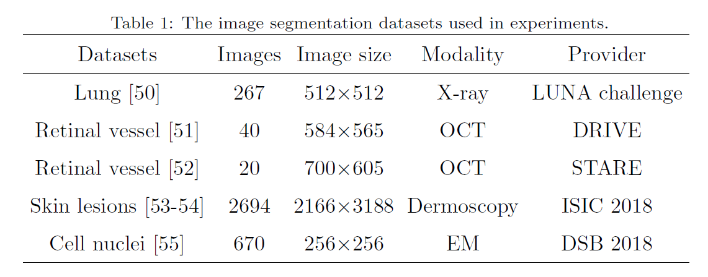
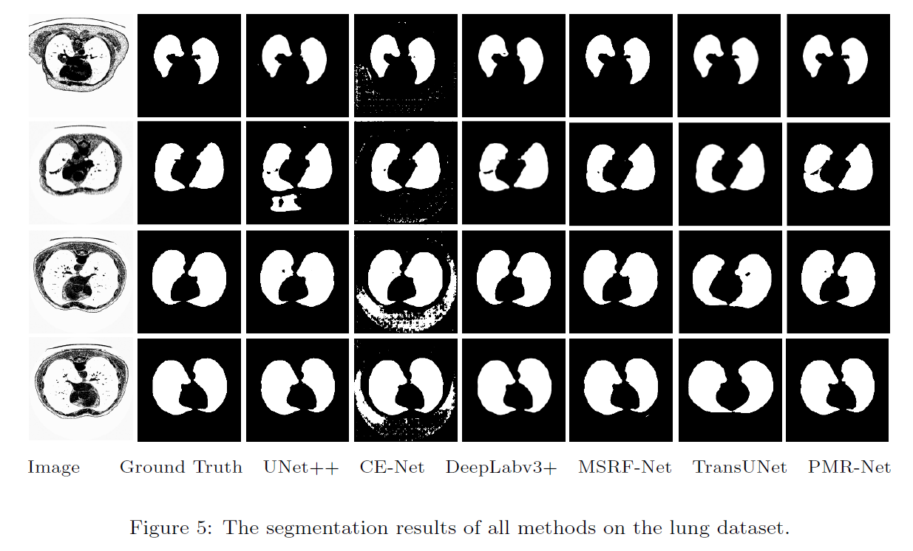
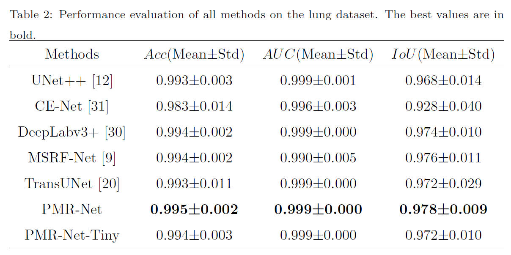

# PMR-Net: Parallel Multi-Resolution Encoder-Decoder Network Framework for Medical Image Segmentation

This is the official repository of the paper titled "PMR-Net: Parallel Multi-Resolution Encoder-Decoder Network Framework for Medical Image Segmentation" which introduces a novel parallel multi-resolution encoder-decoder network for medical image segmentation.

## Workflow

*For a detailed explanation of each component, please refer to our paper.*

## Datasets

To effectively evaluate the performance of PMR-Net, we carry out comprehensive experiments on five commonly used datasets including lung , retinal vessel (DRIVE) , retinal vessel (STARE) , skin lesions (SL) , and cell nucleus datasets, respectively.

We can observe that PMR-Net results in more accurate segmentation results of lung edges than other methods.

